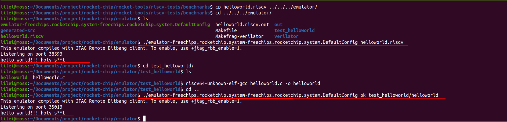

!!! info "这是一份实验索引"
    原线程最后留下了一次 emulator 成功输出，但没有保存仓库 commit、Java/Mill 版本
    和完整命令，因此无法重建可复现教程。

<!-- more -->

## 相关项目

- [chipsalliance/rocket-chip](https://github.com/chipsalliance/rocket-chip)：Rocket Chip Generator
- [chipsalliance/rocket-tools](https://github.com/chipsalliance/rocket-tools)：工具链、模拟器与测试
- [ucb-bar/chipyard](https://github.com/ucb-bar/chipyard)：更完整的 RISC-V SoC 集成框架

原记录还提到需要 Java 和 Mill，但没有留下安装版本。恢复实验时应从目标 commit 的
README 或 Chipyard 对应发布版出发，记录主仓库 commit 与所有 submodule commit。

## 子模块排查

当 `git submodule update --init --recursive` 失败时，先保留原始错误，再检查：

```bash
git submodule status --recursive
git status --short
git config --file .gitmodules --get-regexp 'submodule\..*\.url'
```

常见方向包括：父仓库固定的 commit 不可达、递归子模块 URL 失效、网络访问失败，或
子模块目录有本地修改。不要先使用强制覆盖；它可能丢弃子模块中的本地工作。

原线程记录过两个历史错误线索：

- `riscv-qemu` 克隆时 GitHub 连接被拒绝
- `riscv-pk` 构建时报 `unrecognized opcode 'fence.i'`

这类错误通常与网络或工具链版本组合有关，不能只更新一个子模块后假定兼容。

## 已保留的结果

2023-09-08 的记录显示 emulator 曾运行并输出测试结果：



由于缺少命令和版本矩阵，迁移后只把它视为“曾在当时环境跑通”的证据。

## 来源

- [原始 Discussion #12](https://github.com/junxian-li-hpc/myIssues/discussions/12)
- [Rocket-Chip 仓库](https://github.com/chipsalliance/rocket-chip)
