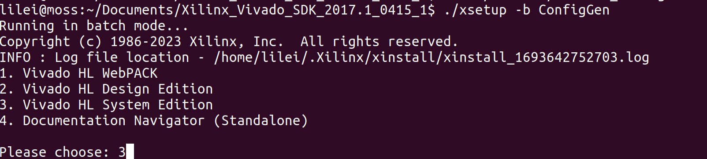
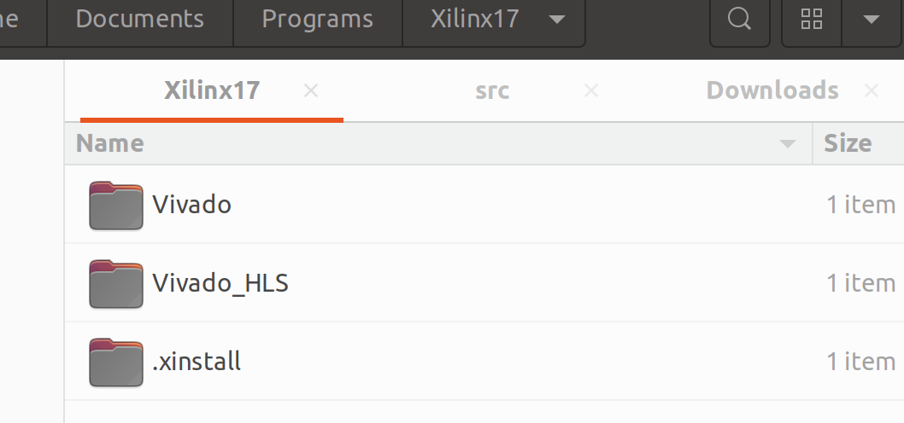
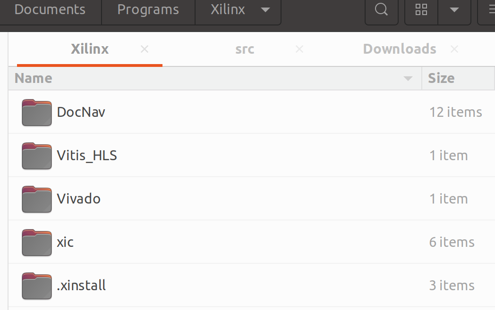
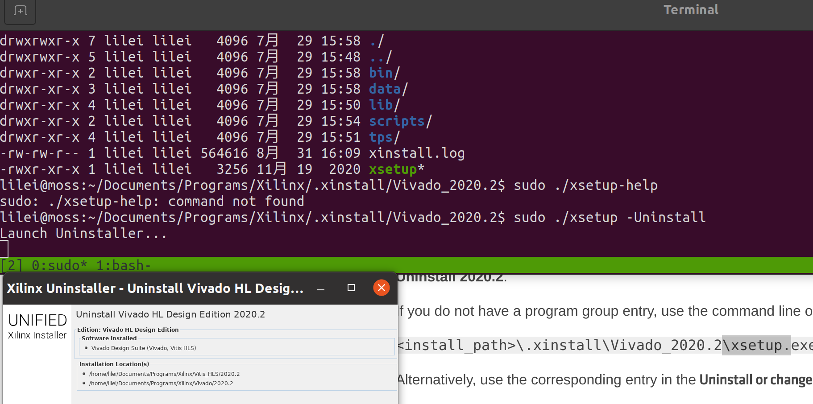

!!! warning "旧版本记录"
    本文只整理 2017.1 和 2020.2 的历史安装过程。依赖包、下载入口和受支持的 Ubuntu
    版本可能已经变化，安装前应以对应版本的 AMD/Xilinx 安装指南为准。

<!-- more -->

## 准备

原环境安装过以下依赖：

```bash
sudo apt install libncurses5 build-essential openjdk-11-jdk
```

进入解压后的安装目录，为安装器增加执行权限：

```bash
chmod a+x ./xsetup
./xsetup -b ConfigGen
```

2017.1 的产品菜单中选择了 `Vivado HL System Edition`：



2020.2 则选择 Vitis，它包含 Vivado。生成的配置默认位于
`~/.Xilinx/install_config.txt`。至少检查 `Edition`、`Product`、`Destination` 和
`Modules`，不要沿用他人的安装路径或安装全部不需要的器件支持。

## 批量安装

确认配置文件后执行：

```bash
./xsetup \
  -c ~/.Xilinx/install_config.txt \
  --agree XilinxEULA,3rdPartyEULA,WebTalkTerms \
  --batch Add
```

`--agree` 表示接受列出的许可条款，应先自行阅读条款。安装完成后，在 Vivado 目录下
安装线缆驱动；2023 年的复测表明，缺少这一步时 Vivado 无法发现开发板：

```bash
cd <安装根目录>/Vivado/2020.2/data/xicom/cable_drivers/lin64/install_script/install_drivers
sudo ./install_drivers
```

## 环境切换

当年的做法是在 `~/.profile` 中只启用一个版本的 `bin` 路径：





更容易控制的方式是在需要的终端中加载对应版本自带的环境脚本：

```bash
source <安装根目录>/Vivado/2017.1/settings64.sh
# 或
source <安装根目录>/Vitis/2020.2/settings64.sh
```

随后用 `command -v vivado` 和 `vivado -version` 确认当前实际版本，避免两个版本同时写入
全局 `PATH`。

## 卸载

对应版本的卸载程序位于安装根目录下的 `.xinstall`：

```bash
cd <安装根目录>/.xinstall/Vivado_2020.2
./xsetup -Uninstall
```



卸载前保存工程、许可配置和自定义板卡文件，并确认目录确实属于要删除的版本。

## 再次安装时报 Program group 已存在

历史报错为：

```text
Program group entry, Xilinx Design Tools, already exists for 2020.2.
Specify a different program group entry
```

残留菜单文件曾位于：

```text
~/.config/menus/applications-merged/Xilinx Design Tools.menu
```

先检查文件内容和所有者，再决定是否移动到备份目录。外部贡献者
[AliangStu](https://github.com/AliangStu) 补充：其环境中需要提升权限才能看到该文件。
这不代表应直接进入 root 会话删除未知文件。

## 来源

- [原始 Issue #5](https://github.com/junxian-li-hpc/myIssues/issues/5)
- [AMD/Xilinx UG973：安装与许可](https://docs.amd.com/r/en-US/ug973-vivado-release-notes-install-license)
- 外部补充：[AliangStu 的评论](https://github.com/junxian-li-hpc/myIssues/issues/5#issuecomment-2798925494)
