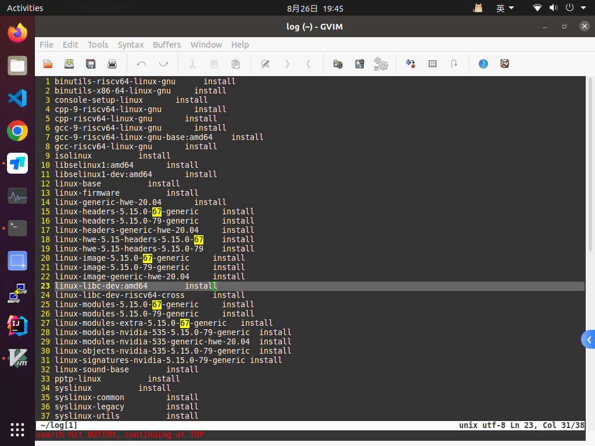
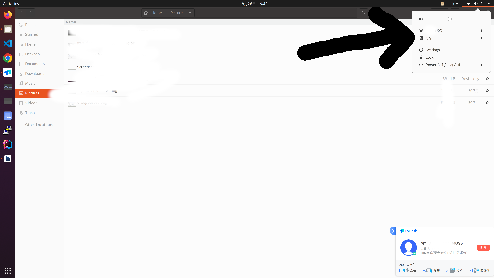

!!! warning "不是通用的 NVIDIA 修复"
    原机器的问题恰好是新内核缺少 `linux-modules-extra`，并不表示所有安装 NVIDIA
    驱动后发生的网络或蓝牙故障都由此引起。以下内核版本只属于 2023 年的实测环境。

<!-- more -->

## 现象与定位

Ubuntu 在安装显卡驱动时从 `5.15.0-67` 升级到 `5.15.0-79`。重启新内核后，网络和
蓝牙同时消失；从 GRUB 的 **Advanced options for Ubuntu** 临时启动旧内核后，两者
恢复，但 `nvidia-smi` 无法正常工作。

对比已安装的内核包：

```bash
dpkg --get-selections | grep '^linux-'
```

当时的列表显示旧内核对应五类包，而新内核少了一项：



缺少的具体包是：

```text
linux-modules-extra-5.15.0-79-generic
```

## 恢复步骤

从仍能联网的旧内核启动后，为目标内核安装缺失包：

```bash
sudo apt-get install linux-modules-extra-5.15.0-79-generic
```

随后正常重启进入新内核，网络、蓝牙和 NVIDIA 驱动均恢复：



## 在其他机器上判断

不要照抄 `5.15.0-79-generic`。先分别记录当前内核和 `/boot` 中的目标内核，再查询对应
软件包是否安装：

```bash
uname -r
ls /lib/modules
apt-cache policy linux-modules-extra-<目标内核版本>
```

只有确认缺包且软件源中存在完全匹配的版本后才安装。若旧内核也无法联网，可从另一台
机器下载匹配发行版和架构的包，或使用安装介质恢复；不要删除仍能启动的旧内核。

## 来源

- [原始 Issue #4](https://github.com/junxian-li-hpc/myIssues/issues/4)
