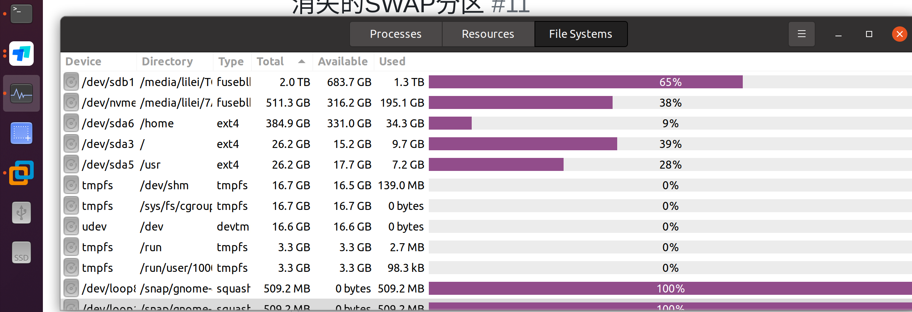
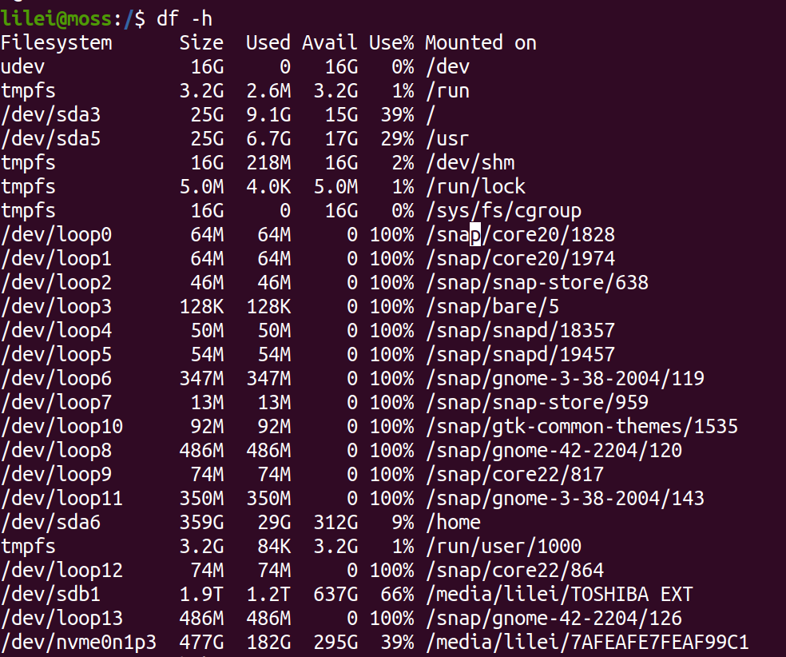
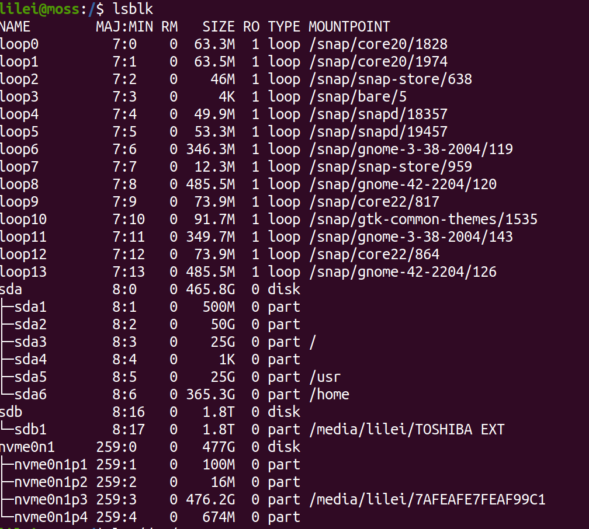
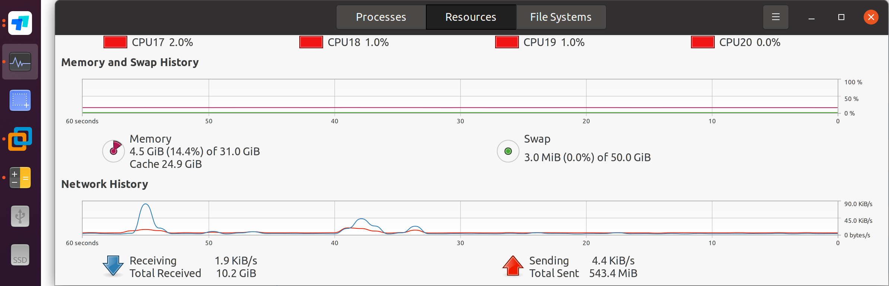

!!! danger "`mkswap` 会覆盖分区内容"
    原记录中的设备是 `/dev/sda2`，它绝不能直接用于其他机器。必须先确认设备、分区
    类型和现有数据；无法确认时停止操作并先备份。

<!-- more -->

## 现象

Ubuntu 20.04 重装时预留了约 50 GiB 的 swap 分区，但开机后系统监视器没有显示 swap。
`df -h` 只显示已挂载的文件系统，不适合用来判断未启用的 swap；列表中的 `tmpfs` 和
`udev` 也不是“消失的硬盘空间”。





使用以下命令同时检查块设备、文件系统签名和当前 swap：

```bash
lsblk -f
sudo blkid
swapon --show
```

历史环境中，`lsblk` 显示系统盘为 `sda`，预留的 50 GiB 分区是 `sda2`：



## 临时启用

确认目标分区没有挂载、没有需要保留的数据后，才可创建 swap 签名并启用：

```bash
sudo mkswap /dev/sda2
sudo swapon /dev/sda2
swapon --show
```

启用后，系统监视器显示了 50 GiB swap：



## 开机自动启用

直接写 `/dev/sda2` 可能因磁盘顺序变化而失效，优先获取 swap UUID：

```bash
sudo blkid /dev/sda2
```

备份 `/etc/fstab` 后加入与实际 UUID 对应的一行：

```fstab
UUID=<swap-uuid> none swap sw 0 0
```

在重启前测试语法和启用结果：

```bash
sudo swapoff /dev/sda2
sudo swapon -a
swapon --show
```

原记录只写到添加 `/dev/sda2 none swap sw 0 0` 并运行 `swapon -a`，没有记录重启后的
最终复测。因此，UUID 写法是迁移时补充的稳妥建议，不冒充当年的实测结果。

## 容量单位补记

图形界面显示约 `384.9 GB`，`df -h` 显示约 `359G`，主要来自十进制 GB 与二进制 GiB
的换算差异，并不是空间丢失。

## 来源

- [原始 Discussion #11](https://github.com/junxian-li-hpc/myIssues/discussions/11)
