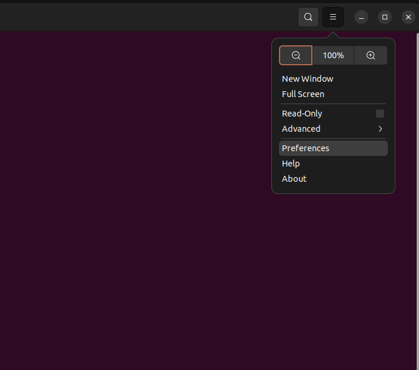
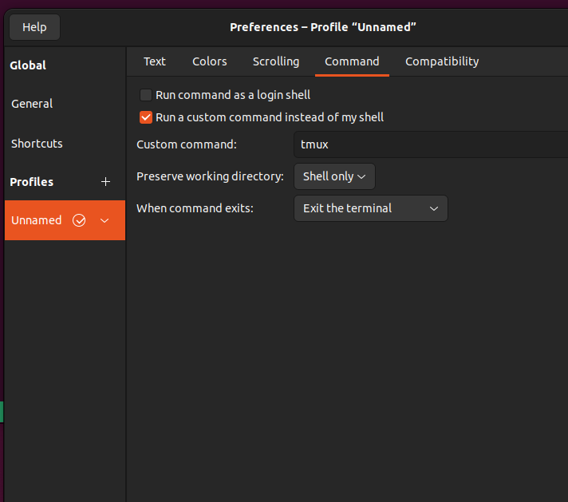

!!! info "适用环境"
    配置来自 Ubuntu 22.04 左右的 GNOME Terminal 与 tmux。插件部分在旧记录中被注释，
    本文也不假定 TPM 已安装。

<!-- more -->

## 安装与基础配置

```bash
sudo apt-get install tmux
```

```tmux title="~/.tmux.conf"
set -g mouse on
set -g history-limit 10000

bind-key c new-window -c "#{pane_current_path}"
bind-key % split-window -h -c "#{pane_current_path}"
bind-key '"' split-window -c "#{pane_current_path}"
```

让已运行的服务器重新读取配置：

```bash
tmux source-file ~/.tmux.conf
```

旧记录还设置了 `default-shell /usr/bin/zsh`。只有 `command -v zsh` 确认路径存在、并且
用户确实希望 tmux 固定使用 Zsh 时才应启用，否则让 tmux 继承登录 shell 更稳妥。

## GNOME Terminal 自动进入 tmux

原设置路径是终端菜单中的 **Preferences**：



在配置文件的 **Command** 页勾选 **Run a custom command instead of my shell**，原记录
直接填写 `tmux`：



为避免每开一个窗口都创建互不相干的会话，可以使用：

```bash
tmux new-session -A -s main
```

修改前保留一个普通终端或 SSH 会话，以便自定义命令写错时恢复设置。

## TPM 插件线索

旧配置列出了 `tmux-plugins/tpm` 和 `tmux-plugins/tmux-sensible`，但初始化行被注释，
说明它们并未形成可确认的启用状态。需要插件时应从 TPM 官方仓库安装，并让
`run '~/.tmux/plugins/tpm/tpm'` 保持在配置末尾。

## 来源

- [原始 Issue #6](https://github.com/junxian-li-hpc/myIssues/issues/6)
- [原始 Discussion #25](https://github.com/junxian-li-hpc/myIssues/discussions/25)
- [原始 Discussion #31](https://github.com/junxian-li-hpc/myIssues/discussions/31)
