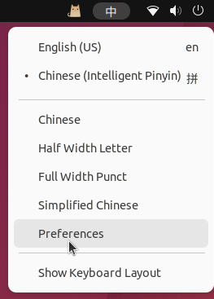
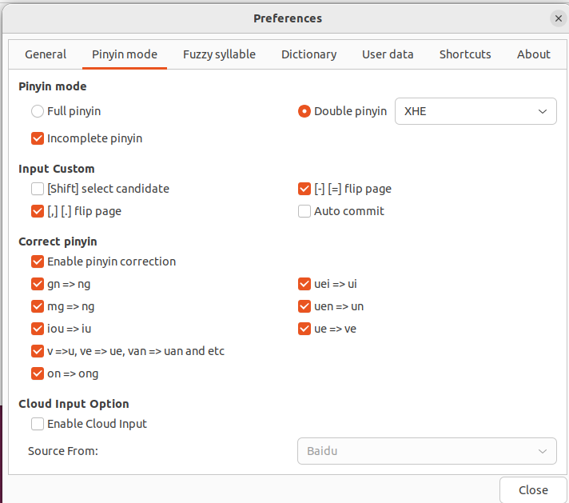

!!! info "适用版本"
    以下界面和名称来自 Ubuntu 22.04 LTS 的 GNOME 桌面。后续版本的菜单位置可能
    不同，但仍可从系统的语言支持和键盘输入源进入。

<!-- more -->

## 添加中文语言支持

1. 打开 **Settings**，进入 **Region & Language**。
2. 检查语言列表中是否已有 **汉语（中国）**。
3. 如果没有，打开 **Install/Remove Languages**，勾选
   **Chinese (Simplified)** 并应用。
4. 点击 **Apply System-Wide**，然后注销并重新登录；原记录采用了重启系统。

## 添加拼音输入源

1. 再次打开 **Settings**，进入 **Keyboard**。
2. 在 **Input Sources** 中点击加号。
3. 添加 **Chinese (Intelligent Pinyin)**。
4. 切换到该输入源，在文本框中确认能显示中文候选字。

Ubuntu 的顶栏输入法菜单中会显示当前的 Intelligent Pinyin 输入源。

## 启用双拼

1. 打开顶栏输入法菜单，选择 **Preferences**。

    

2. 打开 **Pinyin mode**，选择 **Double pinyin**。
3. 在右侧选择双拼方案。原记录使用 **XHE（小鹤双拼）**。

    

4. 关闭设置窗口，在文本框中验证双拼输入。

## 来源

- [原始 Discussion #30](https://github.com/junxian-li-hpc/myIssues/discussions/30)
- [Ubuntu 桌面帮助：使用其他键盘布局](https://help.ubuntu.com/stable/ubuntu-help/keyboard-layouts.html.en)
- [原记录参考的中文步骤](https://blog.csdn.net/windson_f/article/details/124932523)
