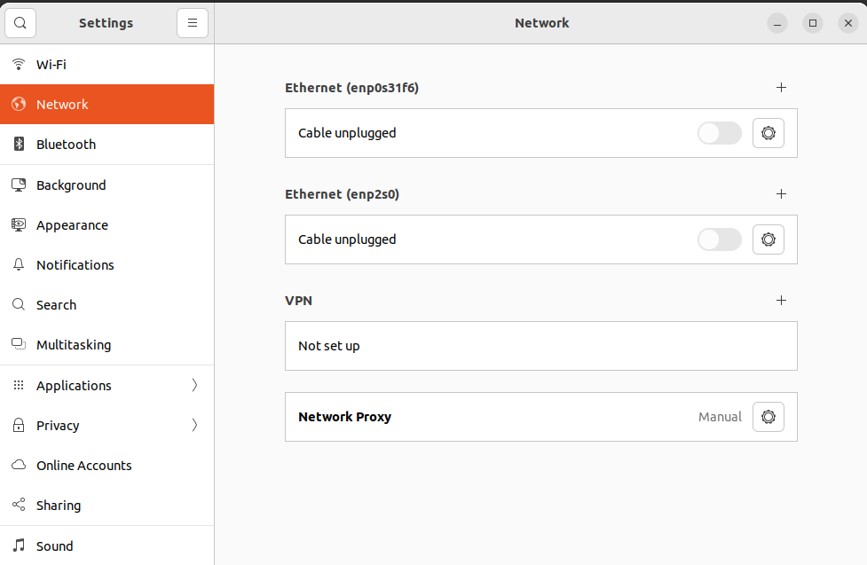
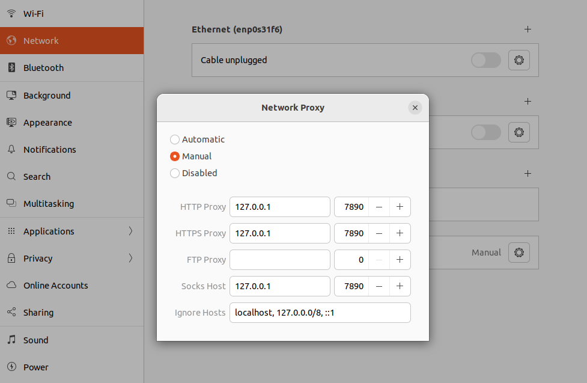

原来的 Ubuntu Essentials 记录横跨软件源、输入法、shell、Vim、tmux、代理与零散软件，
且 Issue #6 和 Discussion #25 大量重复。迁移后，本页只保留入口和仍有上下文的配置。

<!-- more -->

## 已拆分的主题

- [Ubuntu 软件源配置的版本边界](../ubuntu-software-sources/index.md)
- [Ubuntu 22.04 中文输入与双拼设置](../ubuntu-chinese-input/index.md)
- [Vim 基础配置与搜索替换](../vim-notes/index.md)
- [tmux 基础配置与自动进入会话](../tmux-notes/index.md)
- [Zsh 与 Oh My Zsh 安装边界](../zsh-notes/index.md)
- [用 update-alternatives 切换 Java](../java-alternatives/index.md)

## Bash 历史搜索

原记录在交互式 Bash 中将上下方向键绑定为按已输入前缀搜索历史：

```bash title="~/.bashrc"
if [[ $- == *i* ]]; then
  bind '"\e[A": history-search-backward'
  bind '"\e[B": history-search-forward'
fi
```

另有多终端共享历史的配置，但原写法把新的 `PROMPT_COMMAND` 再拼回自身，重复加载时
可能不断增长，因此迁移稿不直接推荐。需要实时共享时，应先确认当前 Bash 是否支持
`PROMPT_COMMAND` 数组，并测试并发终端写入是否符合预期。

## 桌面网络代理

Ubuntu 22.04 GNOME 中，原记录从 **Settings → Network → Network Proxy** 进入手动设置：



当本机代理客户端监听 `127.0.0.1:7890` 时，当时填写了 HTTP、HTTPS 和 SOCKS：



端口只是当时客户端的配置，不是固定值。桌面代理也不会自动覆盖所有终端程序；应分别
检查浏览器、Git、APT 和 shell 工具是否读取系统代理，并避免将监听地址开放到局域网。

## 零散软件与硬件线索

- 文件管理器曾用 `sudo apt install krusader` 安装 Krusader。
- RTL8821CU 无线网卡问题只保留了外部 issue 链接，没有硬件 ID、内核版本和结果，
  因此不迁移成驱动安装步骤。
- 终端快捷键列表多为 Readline 默认行为，可直接查看 `man bash` 的 READLINE 章节，
  无需保留一份可能随终端应用变化的大全。

## 来源

- [原始 Issue #6](https://github.com/junxian-li-hpc/myIssues/issues/6)
- [原始 Discussion #25](https://github.com/junxian-li-hpc/myIssues/discussions/25)
