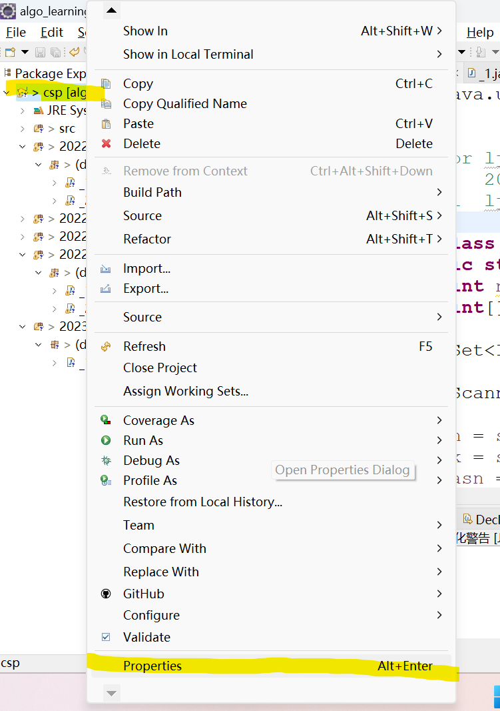
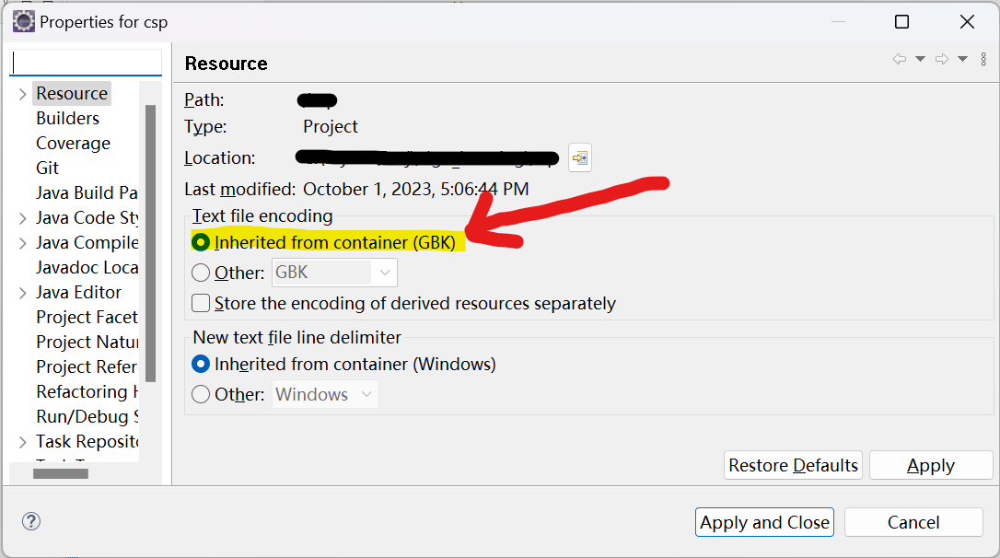
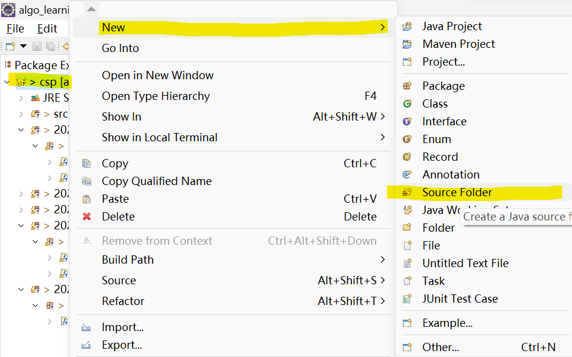
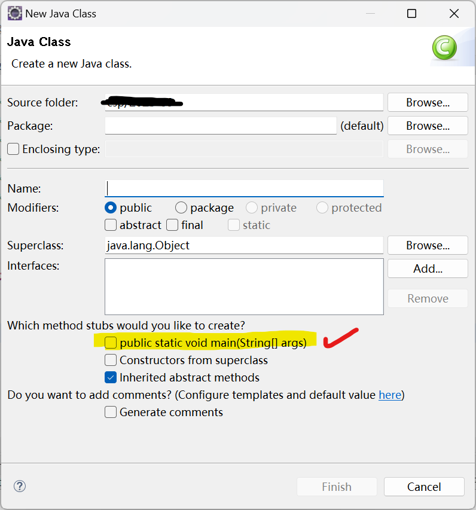
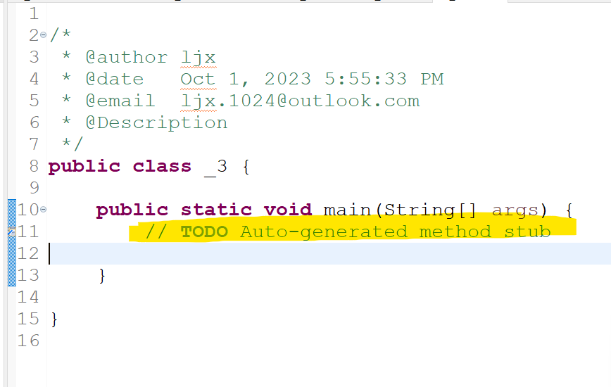
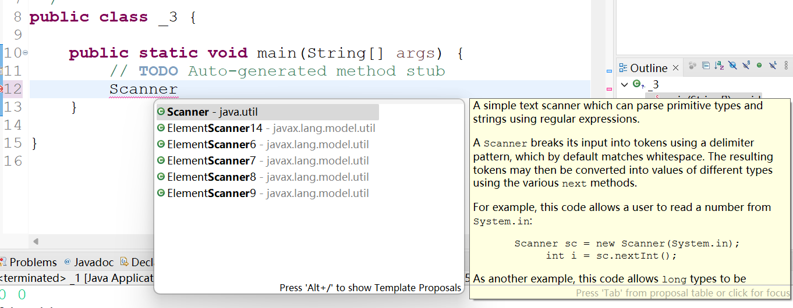
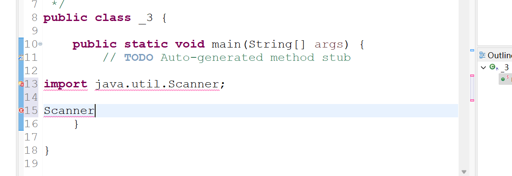

这篇合并四条 2023 年的 Eclipse 小记录。菜单名称来自当时版本，较新的 Eclipse 可能
略有变化。

<!-- more -->

## 修改项目文本编码

右键项目，选择 **Properties**：

在 **Resource** 页的 **Text file encoding** 选择项目实际使用的编码：

改变设置不会自动正确转换已有乱码文件。应先确认文件原始编码，必要时备份后转换，并
将项目编码配置提交到版本控制。

## 添加 Source Folder

一个项目下需要多个源码根目录时，右键项目并选择 **New → Source Folder**：

这与新建普通目录不同：Java 构建路径会把它识别为源码根目录。

## 文本模板

原记录希望在新代码文件中自动加入创建信息，只保存了一条外部教程，没有实际配置与
验证结果。Eclipse 通常可从 **Preferences → Java → Code Style → Code Templates**
管理模板。不要在模板里固定会过期的邮箱或个人信息，团队项目还应服从仓库的格式规则。

## 自动 import 插入到错误位置

新建 Class 时勾选生成 `public static void main`：

生成文件后，在模板注释下方输入 `Scanner` 并接受代码补全：

当时 Eclipse 把自动添加的 `import` 放进了不合法的位置：

删除模板中处于 package/import 区域的异常内容，或手工将 `import` 移到 `package`
声明之后、类型声明之前，后续自动导入恢复正常。这里更像模板位置导致的结构问题，
没有证据表明是 Eclipse 本体的通用 bug。

## 来源

- [原始 Discussion #16](https://github.com/junxian-li-hpc/myIssues/discussions/16)
- [原始 Discussion #17](https://github.com/junxian-li-hpc/myIssues/discussions/17)
- [原始 Discussion #18](https://github.com/junxian-li-hpc/myIssues/discussions/18)
- [原始 Discussion #19](https://github.com/junxian-li-hpc/myIssues/discussions/19)
